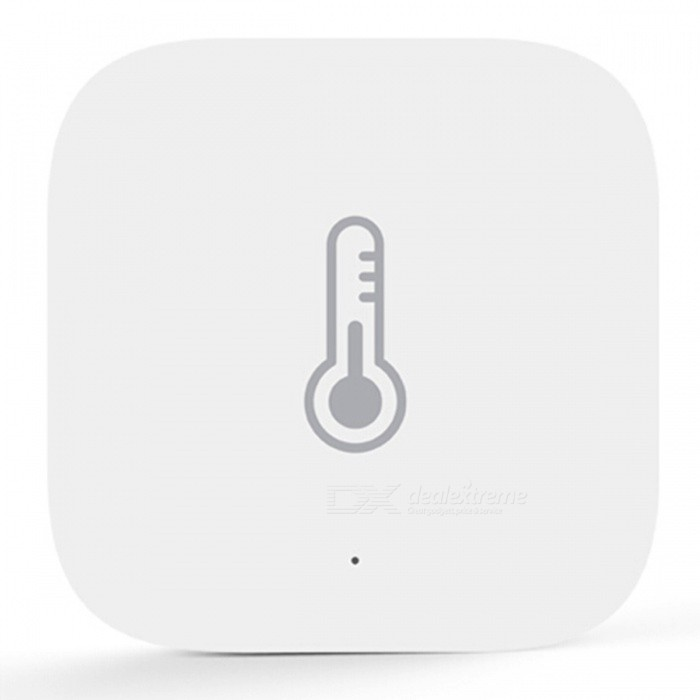
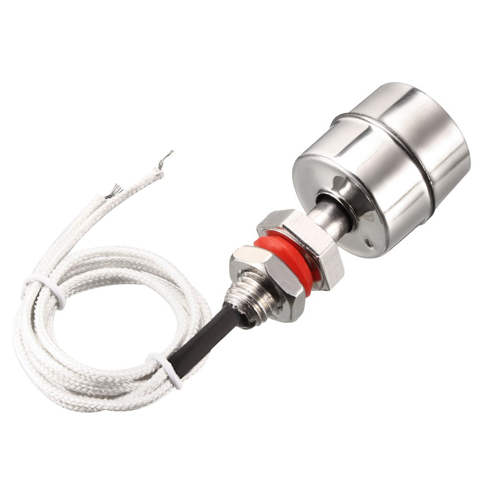

<h1 align="center">
  </a>
   
  Bjorn's Home Assistant based Smart Home
</h1>

My smart home started as a small hobby and grew quickly in two years time. I started with only a few smart lights and now have an almost fully automated home.  

I decided to create this page to give something back to the great Home Assistant community. I learned a lot from shared projects by other users, a good reason to share your own! Hopefully, you can find some inspiration in how I automated my home.

I'll be posting how-to's for different projects in the near future. First of all, on this page I will list all my hardware and software used in my home automation system. Instead of the term HA (Home Assistant) I'll be using hass.io as this is the software I am using. It is HA based, but has it's own operating system and add-ons.
 

  <h4>
    <a href="https://github.com/bjorn-ha/smarthome/#hardware">
      Hardware
    </a>
     | 
     <a href="https://github.com/bjorn-ha/smarthome/#software">
      Software
    </a>
     | 
      <a href="https://github.com/bjorn-ha/smarthome/#projects">
      Projects
    </a>
  </h4>

## Hardware

  <h4>
    <a href="https://github.com/bjorn-ha/smarthome/#networking">
      Networking
    </a>
     | 
    <a href="https://github.com/bjorn-ha/smarthome/#servers">
      Servers
    </a>
 | 
    <a href="https://github.com/bjorn-ha/smarthome/#hubs">
      Hubs
    </a>
 |     
     <a href="https://github.com/bjorn-ha/smarthome/#climate">
      Climate
    </a>
 |     
     <a href="https://github.com/bjorn-ha/smarthome/#audio">
      Audio
    </a>
 |     
     <a href="https://github.com/bjorn-ha/smarthome/#multimedia">
      Multi-Media
    </a>
 |    
      <a href="https://github.com/bjorn-ha/smarthome/#mobile">
      Mobile Devices
    </a>
 |      
      <a href="https://github.com/bjorn-ha/smarthome/#switches">
      Switches
    </a>
 |      
      <a href="https://github.com/bjorn-ha/smarthome/#lights">
      Lights
    </a>
 |           
       <a href="https://github.com/bjorn-ha/smarthome/#remotes">
      Remotes
    </a>
 |      
       <a href="https://github.com/bjorn-ha/smarthome/#sensors">
      Sensors
    </a>
 |     
       <a href="https://github.com/bjorn-ha/smarthome/#controllers">
      Controllers
    </a>
 |      
       <a href="https://github.com/bjorn-ha/smarthome/#safety">
      Safety
    </a>
 |      
       <a href="https://github.com/bjorn-ha/smarthome/#camera">
      Camera's
    </a>
</h4>

### Networking

For all my networking needs I am using equipment made by Ubiquity, called Unifi. Very solid performance up till now and very happy with the purchase. A good and stable WiFi network is a very important first step in your setup. More and more devices are using WiFi in your home. "Simple" WiFi routers might give you problems when your setup starts to grow.
  
The following equipment makes sure that all off my smart devices have a perfect connection:

| Device        |Quantities           |More Info          |Image    |
| ------------- |:-------------:|:-----:|-----------:|
| Ubiquity Unifi Security Gateway | **1X** | [Secure, wired, fully managed Router.](https://www.ui.com/unifi-routing/usg/) ||
| Ubiquity Unifi US-8-60W 8P Switch | **2X** | [Fully managed, 8 Port Switch, 4 Port PoE.](https://www.ui.com/unifi-switching/unifi-switch-8/) ||
| Ubiquity Unifi CloudKey | **1X** | [Host for the Unifi Controller Software.](https://www.ui.com/unifi/unifi-cloud-key/) ||
| Ubiquity Unifi AP AC Lite | **3X** | [Wifi Access Point.](https://www.ui.com/unifi/unifi-ap-ac-lite/) ||
| Ubiquity Unifi UAP AC-M | **1X** | [Outdoor Wifi Access Point (connected as regular AP, not mesh)](https://unifi-mesh.ui.com/#antennas) ||

As a side note, I bought the CloudKey before I had a server running 24/7. I wouldn't buy one now as Docker on my Synology NAS and also my Hassio server would be able to run the Unifi Controller Software in a separate container.
  
Furthermore, there are some cheaper switches at different end-points in my home. I might replace them in the future for Ubiquity switches as well.

### Servers

I used a Raspberry Pi 3 to run Hassio for about four months. By then it became too slow, and I wanted a more reliable solution. I tried to run Hassio in a container on the Synology, but I wasn't happy with the reliability. For that reason, I decided to buy a separate server for my Hassio installation.

| Device        |Quantities           |More Info          |Image    |
| ------------- |:-------------:|:-----:|-----------:|
| Synology DS218+ | **1X** | [Intel based Synology Storage Server and is used to run multiple containers in Docker.](https://www.synology.com/nl-nl/products/DS218+) ||
| Intel NUC BOXNUC6CAYH | **1X** | [Celeron Based Intel NUC, 4GB RAM, 120GB SSD.](https://ark.intel.com/content/www/us/en/ark/products/95062/intel-nuc-kit-nuc6cayh.html) ||

I am amazed by the performance difference between the NUC and the Rpi. I decided to buy the Celeron based NUC as I have most of my other containers running on the Synology already. With this in mind, I am only running Hassio with HassOS on the NUC (directly etched on the SSD with etcher).

### Hubs

As most of my devices are directly connected to WiFi, I only needed a hub to use my Zigbee Ikea Tradfri Lights. I've tried both the Ikea Tradfri and Philips Hue bridges for a while. With the Ikea bridge, everything worked "ok" in combination with Home Assistant, but it was unstable and needed a restart every day. With the Philips Hue bridge, I was able to control the Ikea lights, but I noted a very annoying flickering in each of the lights. After a tip from some users, I decided to buy a Conbee USB stick to use directly in the NUC to setup a Zigbee network. This one is working great since. Another great feature about this solution is that you are able to connect any zigbee device from any brand into one network.

| Device        |Quantities           |More Info          |Image    |
| ------------- |:-------------:|:-----:|-----------:|
| Dresden Elektronik Conbee II | **1X** | [Zigbee USB Router](https://phoscon.de/en/conbee2) ||

The Conbee II is running on a hassio add-on called DeconZ. More information about DeconZ in the <a href="https://github.com/bjorn-ha/smarthome/#software">software</a> section of this page

### Climate

I have a few Nest Thermostats around the house. They control our HVAC systems. The Nest products are really high build quality and I like the look of them.
  
Unfortunattely, Google decided that the Nest for Developers program (needed to integrate them in hass.io) will be stopped. Current users can keep on using the developers account, but nobody knows for how long. New users can not create a developers account. Hopefully, Google will release an API for their Google Home/Assistant. But this is not expected to happen anytime soon.

For this reason I would not recommend buying Nest to integrate into any home automation project.

| Device        |Quantities           |More Info          |Image    |
| ------------- |:-------------:|:-----:|-----------:|
| Nest 3rd Generation Learning Thermostat | **3X** | [Nest 3rd Generation Learning Thermostat](https://store.google.com/us/product/nest_learning_thermostat_3rd_gen?hl=en-US) ||

### Audio

For my audio solution I have chosen Denon Heos over Sonos purely because of the sound quality of the Heos over Sonos (very personal opinion of course). Heos integration into Home Assistant is getting better with every update, but purely on the integration part, Sonos is still superior over Heos. 
  
Also, one of the best features of the Heos system is the battery-operated Heos 1, they are normally used in the Kitchen where they are also being charged. But when we want to watch a movie we can use the two as surround satellite speakers. When we go for a swim we take one of them with us! (Battery time approx 7 hrs)

| Device        |Quantities           |More Info          |Image    |
| ------------- |:-------------:|:-----:|-----------:|
| Denon Heos 1 HS2 | **2X** | [Small Wifi Multi-room Speaker](https://www.denon.co.uk/uk/heos/heos-1-portable-wireless-speakers) ||
| Denon Heos 1 Go-Pack | **2X** | [Battery and splash guard for Heos 1](https://www.denon.co.uk/uk/heos/heos-1-go-packhs2) ||
| Denon Heos 7 HS2 | **1X** | [Large Wifi Multi-room Speaker](https://www.denon.co.uk/uk/heos/heos-7-wireless-speaker-system) ||
| Denon Heos Bar | **1X** | [Soundbar and receiver in one (4x HDMI in)](https://www.denon.co.uk/uk/heos/heos-bar) ||
| Denon Heos Subwoofer | **1X** | [Subwoofer](https://www.denon.co.uk/uk/heos/heos-subwoofer) ||

### Multi-Media

Other Multi-Media equipment integrated into hass.io:

  
| Device        |Quantities           |More Info          |Image    |
| ------------- |:-------------:|:-----:|-----------:|
| Sony Bravia KDL55X8500D | **1X** | [Sony 4K 55" Bravia Television](https://www.sony-mea.com/en/electronics/support/televisions-projectors-lcd-tvs-android-/kd-55x8500d/specifications) ||
| Apple TV 4K | **2X** | [Apple TV](https://www.apple.com/apple-tv-4k/) ||
| Google Home Mini | **1X** | [Google Home Mini](https://store.google.com/us/product/google_home_mini?hl=en-US) ||

The Google home mini sits on a cabinet with the microphone disabled. It's only used for Text to Speech (TTS) notifications. The moment the Heos system is supporting TTS I will remove it from my setup.

### Mobile Devices

This is a list of Mobile devices connected to the setup. Most of them are used to control the HA App (beta 2.0). The two mobile phones form the backbone of my presence detection.
  
The iPad Mini is in a wall mount installed in the living room. It's being used whenever we are awake and home. Works great.

| Device        |Quantities           |More Info          |Image    |
| ------------- |:-------------:|:-----:|-----------:|
| Apple iPhone | **2X** | [iPhones](https://www.apple.com/iphone/) ||
| Apple iPad | **3X** | [Multiple version of the iPad](https://www.apple.com/ipad/) ||
| Vogel's  PTS 1216 TabLock | **1X** | [Wall Mount for the iPad Mini 3](https://www.vogels.com/en/p/pts-1216-tablock-for-ipad-mini-1-2-3) ||

### Switches

One of the first projects within my smart home was to replace some general switches with WiFi connected switches. As I didn't have a lot of experience yet and a lot of info was available for the Sonoff basic switches, this was my way to go. Most of them are operational already for about two years and are still working without issues.

| Device        |Quantities           |More Info          |Image    |
| ------------- |:-------------:|:-----:|-----------:|
| Sonoff Basic R1/R2 | **8X** | [Sonoff Basic](https://sonoff.tech/product/wifi-diy-smart-switches/basicr2) ||
| Sonoff POW R2 | **2X** | [Sonoff POW R2 (used to switch 15A devices)](https://sonoff.tech/product/wifi-diy-smart-switches/powr2) ||
| Sonoff S20 | **5X** | [Sonoff S20](https://sonoff.tech/product/wifi-smart-plugs/s20) ||
| Sonoff 4CH Pro R2 | **1X** | [Sonoff 4CH Pro, used to switch lower voltage](https://sonoff.tech/product/wifi-diy-smart-switches/4ch-r2-pro-r2) ||

All of the switches are flashed with custom firmware. More information in the <a href="https://github.com/bjorn-ha/smarthome/#software">software</a> section of this page

### Lights

Up till now I really like the Ikea Tradfri lights. I have chosen them mostly for their lower price and wide range of products. The only down-sides of the lights is that they don't dim as far as Philips Hue lights do. Also changing color temperature and brightness can't be done in one go but needs two different commands from hass.io. I will post a work-around for this in the projects folder soon.
  
I've chosen the Xiaomi Yee Lights as they can be controlled directly over WiFi without using the Yeelight app/cloud. This can be done with the YeeLight integration of hass.io without any need of flashing custom firmware/soldering.

| Device        |Quantities           |More Info          |Image    |
| ------------- |:-------------:|:-----:|-----------:|
| Ikea Tradri Blulbs | **9X** | [Mix of different Ikea Tradfri Bulbs](https://www.ikea.com/us/en/search/products/?q=tradfri) ||
| Ikea Tradfri Spots | **25X** | [Mix of different Ikea Tradfri Spots](https://www.ikea.com/us/en/search/products/?q=tradfri) ||
| Ikea Tradfri LED Driver | **2X** | [Ikea Tradfri Led driver for integrated lighting in kitchen](https://www.ikea.com/us/en/search/products/?q=tradfri) ||
| Xiaomi Yeelight Led Strip | **2X** | [Yeelight RGB LED Strip](https://www.yeelight.com/en_US/product/pitaya-plus) ||
| Xiaomi Yeelight RGB Bulb | **1X** | [Yeelight RGB LED Bulb](https://www.yeelight.com/en_US/product/lemon-color) ||

### Remotes

I still have some remotes around the house. The Ikea Tradfri remotes are not used to switch lights anymore. They all control our multi-room audio system. The Philips Hue Dimmer is at the front door entrance, just in case some presence detection didn't work. Also, it is used by sleep-in guests to switch on/off scenes.

| Device        |Quantities           |More Info          |Image    |
| ------------- |:-------------:|:-----:|-----------:|
| Ikea Tradri Remote | **3X** | [Tradfri Remote Control (Zigbee)](https://www.ikea.com/us/en/p/tradfri-remote-control-00443130/) ||
| Philips Hue Dimmer Switch | **1X** | [Philips Hue Dimmer Switch (Zigbee)](https://www2.meethue.com/en-us/p/hue-dimmer-switch/046677473372) ||

More information on how to use the Ikea Remotes for different tasks than switching Ikea Bulbs will be in the <a href="https://github.com/bjorn-ha/smarthome/#projects">projects</a> section of this page soon.

### Sensors

The heart of every home automation system: Sensors! If your setup doesn't know the state in and around your house, there is not much you can automate. There are many different sensors available in the market, for every project you might think of, there is a sensor. 
  
I mainly use sensors to know where people are in the house (motion), if they are sleeping (bed-occupancy), measure light and temperatures.

I will make how-to's about most of my sensors and the way I integrated them in hass.io. They will be in the <a href="https://github.com/bjorn-ha/smarthome/#projects">projects</a> section of this page soon. 

I used RF sensors for motion and door sensors before. But I am currently in the process of changing all of them to Zigbee devices. I won't mention the RF sensors anymore.

| Device        |Quantities           |More Info          |Image    |
| ------------- |:-------------:|:-----:|-----------:|
| Xiaomi Aqara Motion Detector | **4X** | [Xiaomi Aqara Motion Detector (Zigbee)](https://www.aqara.com/en/human_motion_sensor.html) ||
| Xiaomi Aqara Door/Window Detector| **3X** | [Xiaomi Aqara Door/Window Detector (Zigbee)](https://www.aqara.com/en/door_and_window_sensor.html) ||
| Xiaomi Aqara Temperature/Humidity | **3X** | [Xiaomi Aqara Temperature/Humidity (Zigbee), used in rooms without Nest Thermostat](https://www.aqara.com/en/temperature_humidity_sensor.html) ||
| Ideal Security SK630 Pressure Mat | **2X** | [Pressure Mat for Bed Occupancy Sensor](https://www.amazon.com/Ideal-Security-SK630-Pressure-Triggered/dp/B00GUNX7WY/ref=sr_1_1_sspa?crid=2OGOO7WFA4R7A&keywords=ideal+security+sk630+pressure+mat+alarm+with+chime&qid=1569710790&sprefix=ideal+security+pre%2Caps%2C326&sr=8-1-spons&psc=1&spLa=ZW5jcnlwdGVkUXVhbGlmaWVyPUExTkJOMUdCR0haWDVaJmVuY3J5cHRlZElkPUEwMjE4NDg2MjJLUFlLQ1VMNTBVQSZlbmNyeXB0ZWRBZElkPUEwMDc2NTYxQTFWTDhBQTNTTThZJndpZGdldE5hbWU9c3BfYXRmJmFjdGlvbj1jbGlja1JlZGlyZWN0JmRvTm90TG9nQ2xpY2s9dHJ1ZQ==) ||
| Generic 50 KG Load Cells/HX711 | **1X** | [Load Cell for Bed Occupancy Sensor](https://www.amazon.com/Half-Bridge-Weighting-Amplifier-Arduino-WIshioT/dp/B07B4DNJ2L/ref=sr_1_2_sspa?keywords=hx711+load+cell&qid=1569707561&sr=8-2-spons&psc=1&spLa=ZW5jcnlwdGVkUXVhbGlmaWVyPUExRFA3MjJFVEtGWVEzJmVuY3J5cHRlZElkPUEwOTUxMjAxMUo0OElGNU1HRzJLQSZlbmNyeXB0ZWRBZElkPUEwODA3OTY1MjhNMDkyQ09TQ1pPTCZ3aWRnZXROYW1lPXNwX2F0ZiZhY3Rpb249Y2xpY2tSZWRpcmVjdCZkb05vdExvZ0NsaWNrPXRydWU=) ||
| Generic BH1750 Lux Sensor | **2X** | [Light Intensity Sensor](https://www.amazon.com/HiLetgo-BH1750FVI-Digital-Intensity-Arduino/dp/B01DLG4NZC/ref=sr_1_1_sspa?keywords=bh1750&qid=1569707705&sr=8-1-spons&psc=1&spLa=ZW5jcnlwdGVkUXVhbGlmaWVyPUEzVE45Vjc4T0tXWVRRJmVuY3J5cHRlZElkPUEwNDg0OTY2MjgzTEE5RjJEVlk3JmVuY3J5cHRlZEFkSWQ9QTA2NjQ3NjBLQkpYSlIxWjhHRTMmd2lkZ2V0TmFtZT1zcF9hdGYmYWN0aW9uPWNsaWNrUmVkaXJlY3QmZG9Ob3RMb2dDbGljaz10cnVl) ||
| Generic DS18B20 Temperature Sensor | **1X** | [Waterproof Temperature Sensor](https://www.amazon.com/Stayhome-DS18b20-Stainless-Waterproof-Temperature/dp/B07QMV23WK/ref=sr_1_1?keywords=ds18b20+1pc&qid=1569707959&sr=8-1) ||
| Generic Float Switch | **1X** | [Float Switch for pool water level](https://www.amazon.com/uxcell-Stainless-Switch-Vertical-Liquid/dp/B07DYWR3RP/ref=sr_1_24?keywords=float+switch+stainless&qid=1569708077&sr=8-24) ||

<i>** There are Amazon links in above list. None of them are affliate. </i>

### Controllers

As almost every home automation builder, ESP8266 or ESP32 controllers are the way to go. They are flexible, small, cheap and there is a lot of support/community developed firmware for them. I used the NodeMCU in almost all my projects. It is very easy to flash them, they are very small for the number of pins you get and you can power them by any USB charger.

| Device        |Quantities           |More Info          |Image    |
| ------------- |:-------------:|:-----:|-----------:|
| NodeMCU v2 | **6X** | [NodeMCU v2 Development Board](https://www.amazon.com/ESP8266-microcontroller-NodeMCU-WiFi-CP2102/dp/B071WRD25D/ref=sr_1_11_sspa?crid=CWVSDBSVGD13&keywords=nodemcu+v2&qid=1569709636&sprefix=nodemcu%2Caps%2C314&sr=8-11-spons&psc=1&spLa=ZW5jcnlwdGVkUXVhbGlmaWVyPUEyU0tJNjc0WkgwMzJWJmVuY3J5cHRlZElkPUEwNTg1ODMwMTZDS0NOOUVaU0hLQyZlbmNyeXB0ZWRBZElkPUEwNTExMDcxM0QzVTkwT1RCWUk0OCZ3aWRnZXROYW1lPXNwX210ZiZhY3Rpb249Y2xpY2tSZWRpcmVjdCZkb05vdExvZ0NsaWNrPXRydWU=) ||

<i>** There are Amazon links in above list. None of them are affliate. </i>

### Safety

As said before, I like the Nest products, but:

Unfortunattely, Google decided that the Nest for Developers program (needed to integrate them in hass.io) will be stopped. Current users can keep on using the developers account, but nobody knows for how long. New users can not create a developers account. Hopefully, Google will release an API for their Google Home/Assistant. But this is not expected to happen anytime soon.

For this reason I would not recommend buying Nest to integrate into any home automation project.

| Device        |Quantities           |More Info          |Image    |
| ------------- |:-------------:|:-----:|-----------:|
| Nest Protect | **5X** | [Nest Protect Smoke/Carbon Monoxide Detector](https://store.google.com/us/product/nest_protect_2nd_gen?hl=en-US) ||

### Camera's

I like the Foscam brand for Camera's. I currently have two of them installed. Foscam has it's own integration into hass.io. So is very easy to set-up.

| Device        |Quantities           |More Info          |Image    |
| ------------- |:-------------:|:-----:|-----------:|
| Foscam FI9901EP | **1X** | [Foscam FI9901EP Outdoor PoE IP Camera](https://www.foscam.com/FI9901EP.html) ||
| Foscam R2 | **1X** | [Foscam R2 - Babymonitor](https://www.foscam.com/R2.html) ||

### Air Quality

I live in an area with quite a bit of polution so I wanted a few air purifiers. I've chosen two different models (capacity) of Xiaomi Air Purifiers. Integrating them in hass.io was a bit of a hassle, but all three are now working and reporting AQI, temp, humidity and filterlife remaining. Also the OLED displays and modes can be changed by using automations.

| Device        |Quantities           |More Info          |Image    |
| ------------- |:-------------:|:-----:|-----------:|
| Xiaomi Air Purifier Pro | **1X** | [Xiaomi Air Purifier Pro](https://www.mi.com/in/air2s/) ||
| Xiaomi Air Purifier 2S | **2X** | [Xiaomi Air Purifier 2S](https://www.mi.com/in/air2s/) ||

# Work in Progress

## Software
## Projects
